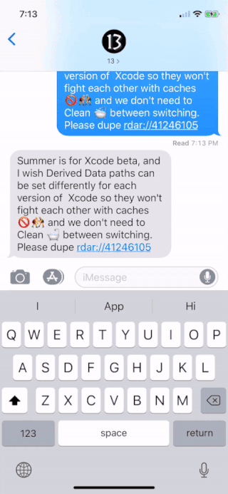

# Ladybug 🐞

Ladybug is a simple iOS app handles Radar links ([rdar://](rdar://)) gracefully.

## Features

- ✅ Open source iOS project written in Swift 😇
- ✅ Opens a radar link from other app, clipboard, or manually input. 😎 Then it redirects to [Open Radar](https://openradar.appspot.com/), [Apple Radar](https://bugreport.apple.com/) (Bug Reporter) or [Brisk](https://github.com/br1sk/brisk-ios) app 💪
- ✅ Support multiple formats of radar links 💡
- ✅ Safari Reader mode for [Open Radar](https://openradar.appspot.com/) 👁
- ✅ History 🕑
- ✅ Bookmarks 📖
- ✅ Retrive radar metadata from [Open Radar](https://openradar.appspot.com/) 📲
- ✅ Export radars ⏫
- ✅ Import your radars from [Open Radar](https://openradar.appspot.com/) by email ⏬
- ✅ 3D Touch Peek & Pop 👀
- [ ] iCloud sync for History and Bookmarks radars 🌏

Also... 

- ✅ Free without ads 🆓
- ✅ No third-party tracking or analytics 🚫

## Install

- Clone the repo on [GitHub](https://github.com/ethanhuang13/ladybug)
- Open the project with Xcode 9 or above
- Change bundle ID to something like com.yourcompany.Ladybug
- Build and run on your iOS devices

## Contribution 

- Feedback and [issues](https://github.com/ethanhuang13/ladybug/issues/new) are welcome

## Motivation

As iOS developer I follow a lot of developers on Twitter. It's painful every time I saw a [rdar://](rdar://) in Tweetbot but cannot tap it to open. Therefore I created Ladybug, a solution for iOS to open or bookmark Radar links.

I use a lot of tools made by other developers. And I always want to contribute something to the community. With Ladybug I finally found something: **1.** I need. **2.** others might need too. **3.** I can do. Consider Ladybug my love letter to Apple dev community 😍. Enjoy!
